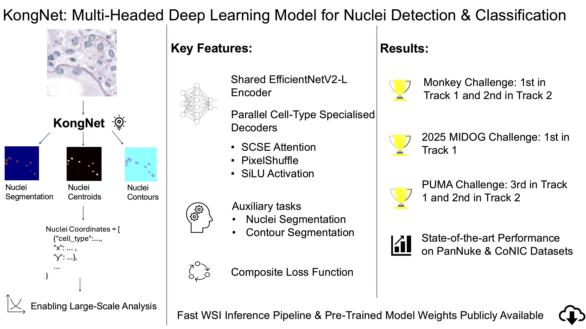
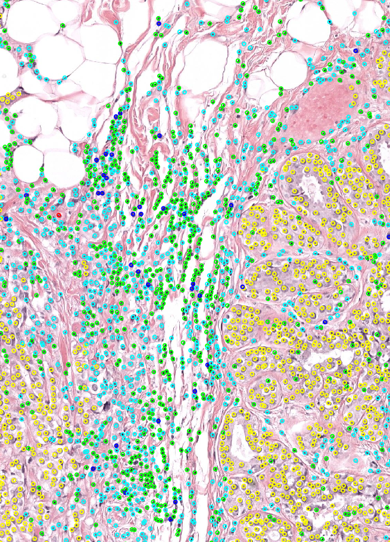

# KongNet Inference Main

Whole slide image (WSI) Inference pipeline for KongNet models supporting multiple histopathology datasets including MIDOG, PanNuke, CoNIC and MONKEY.
<!--  -->


## 🚀 Features

- **Pre-trained Models**: MIDOG, PanNuke, CoNIC and MONKEY ready-to-use model weights from HuggingFace
- **Whole Slide Image Processing**: Efficient WSI inference through multiprocessing and caching
- **Model Ensemble Support**: Support for multiple model checkpoints and ensemble inference
- **Quality Control**: Tissue detection using GrandQC



## 📋 Requirements

Install the required dependencies:

```bash
pip install -r requirements.txt
```

optional: testing
```bash
python tests/run_tests.py
```

### System Requirements
- Python 3.10+ (Recommended 3.12)
- CUDA-compatible GPU (Recommended cuda > 12)
- Sufficient RAM for WSI processing (Recommended at least 32GB)


## 📖 Usage Examples

### Basic Usage

#### MIDOG
```bash
# Specify input and output directories
python inference_MIDOG.py \
    --input_dir /data/midog/wsi \
    --output_dir /results/midog \
    --cache_dir /tmp/cache
```

#### PanNuke 
```bash
# Specify input and output directories
python inference_panNuke.py \
    --input_dir /data/pannuke/wsi \
    --output_dir /results/pannuke \
    --cache_dir /tmp/cache
```

#### CoNIC 
```bash
# Specify input and output directories
python inference_CoNIC.py \
    --input_dir /data/conic/wsi \
    --output_dir /results/conic \
    --cache_dir /tmp/cache
```

#### MONKEY
```bash
# Specify input and output directories
python inference_MONKEY.py \
    --input_dir /data/monkey/wsi \
    --output_dir /results/monkey \
    --cache_dir /tmp/cache
```

### Advanced Examples

#### MIDOG
```bash
# Full configuration example
python inference_MIDOG.py \
    --input_dir /data/midog/test_set \
    --output_dir /results/midog_predictions \
    --cache_dir /fast_ssd/cache \
    --weights_dir ./pretrained_models \
    --checkpoint_name "KongNet_Det_MIDOG_1.pth" \
    --additional_checkpoints "KongNet_Det_MIDOG_2.pth" \
    --mask_dir /data/midog/tissue_masks \
    --batch_size 64 \
    --num_workers 10
```

#### PanNuke 
```bash
# Full configuration example with tissue masks
python inference_panNuke.py \
    --input_dir /data/pannuke/test_set \
    --output_dir /results/pannuke_predictions \
    --cache_dir /fast_ssd/cache \
    --weights_dir ./pretrained_models \
    --checkpoint_name "KongNet_PanNuke_1.pth" \
    --additional_checkpoints "KongNet_PanNuke_2.pth" \
    --mask_dir /data/pannuke/tissue_masks \
    --batch_size 64 \
    --num_workers 10
```

#### CoNIC
```bash
# Full configuration example
python inference_CoNIC.py \
    --input_dir /data/conic/test_set \
    --output_dir /results/conic_predictions \
    --cache_dir /fast_ssd/cache \
    --weights_dir ./pretrained_models \
    --checkpoint_name "KongNet_CoNIC_1.pth" \
    --additional_checkpoints "KongNet_CoNIC_2.pth" \
    --mask_dir /data/conic/tissue_masks \
    --batch_size 64 \
    --num_workers 10
```

#### MONKEY
```bash
# Full configuration example 
python inference_MONKEY.py \
    --input_dir /data/monkey/test_set \
    --output_dir /results/monkey_predictions \
    --cache_dir /fast_ssd/cache \
    --weights_dir ./pretrained_models \
    --checkpoint_name "KongNet_MONKEY_1.pth" \
    --additional_checkpoints "KongNet_MONKEY_2.pth" \
    --mask_dir /data/monkey/tissue_masks \
    --batch_size 64 \
    --num_workers 10
```

#### PUMA Track 1
```bash
# Full configuration example 
python inference_PUMA_T1.py \
    --input_dir /data/puma/test_set \
    --output_dir /results/puma_predictions \
    --cache_dir /fast_ssd/cache \
    --weights_dir ./pretrained_models \
    --checkpoint_name "KongNet_PUMA_T1_3.pth" \
    --additional_checkpoints "KongNet_PUMA_T1_4.pth" \
    --mask_dir /data/puma/tissue_masks \
    --batch_size 64 \
    --num_workers 10
```

#### PUMA Track 2
```bash
# Full configuration example 
python inference_PUMA_T2.py \
    --input_dir /data/puma/test_set \
    --output_dir /results/puma_predictions \
    --cache_dir /fast_ssd/cache \
    --weights_dir ./pretrained_models \
    --checkpoint_name "KongNet_PUMA_T2_2.pth" \
    --additional_checkpoints "KongNet_PUMA_T2_3.pth" \
    --mask_dir /data/puma/tissue_masks \
    --batch_size 64 \
    --num_workers 10
```

## 🔧 Command Line Arguments

### Input/Output Arguments
- `--input_dir`: Directory containing WSI files (default: `./test_input`)
- `--output_dir`: Directory to save results (default: `./test_output`)
- `--cache_dir`: Directory for intermediate caching (default: system-specific)
- `--weights_dir`: Directory to store model weights (default: `./model_weights`)

### Model Configuration
- `--hf_repo_id`: HuggingFace repository ID for model weights
  - `"TIACentre/KongNet_pretrained_weights"`
- `--checkpoint_name`: Model checkpoint filename (For details see [Hugging Face page](https://huggingface.co/TIACentre/KongNet_pretrained_weights))
  - MIDOG: `"KongNet_Det_MIDOG_1.pth"`
  - PanNuke: `"KongNet_PanNuke_1.pth"`
  - CoNIC: `"KongNet_CoNIC_1.pth"`
  - MONKEY: `"KongNet_MONKEY_1.pth"`
- `--additional_checkpoints`: Additional checkpoints for ensemble (space-separated)
- `--local_weights`: Use local weight files instead of downloading from HuggingFace (space-separated paths)

### Processing Options
- `--no_tta`: Disable test time augmentation (faster inference)
- `--single_wsi`: Process only specified WSI filename
- `--mask_dir`: Directory containing pre-computed tissue masks (optional)
- `--num_workers`: Number of worker processes (default: 10)
- `--batch_size`: Batch size for inference (default: 64)

### Supported WSI Formats
- `.svs` 
- `.tif`, `.tiff` 
- `.ndpi` 
- `.mrxs`

## 📝 Output Format

All pipelines output results in **SQLite annotation store format** (`.db` files) compatible with TIAToolbox.

### Output Files
- **MIDOG**: `{wsi_name}_mitosis.db` 
- **PanNuke**: `{wsi_name}_pannuke.db`  
- **CoNIC**: `{wsi_name}_conic.db`
- **MONKEY**: `{wsi_name}_monkey.db`

### Example Python Script for Loading Results
```python
from tiatoolbox.annotation.storage import SQLiteStore

# Load detection results
store = SQLiteStore('/example_output.db')

# Access detection points
for annotation in store.values():
    geometry = annotation.geometry  # Point coordinates
    properties = annotation.properties  # Cell type, confidence, etc.
    print(f"Cell at ({geometry.x}, {geometry.y}): {properties}")

store.close()
```

### Cell Types by Pipeline

#### MIDOG
- **mitotic_figure**: Mitotic figure detection points

#### PanNuke  
- **neoplastic**: Neoplastic cells
- **inflammatory**: Inflammatory cells
- **connective**: Connective tissue cells
- **dead**: Dead cells
- **epithelial**: Epithelial cells
- (Output of overall detection head is omitted in WSI inference pipeline)

#### CoNIC
- **neutrophil**: Neutrophils
- **epithelial**: Epithelial cells  
- **lymphocyte**: Lymphocytes
- **plasma**: Plasma cells
- **eosinophil**: Eosinophil cells
- **connective**: Connective cells

#### MONKEY
- **overall_inflammatory**: Overall mononuclear leukocytes
- **lymphocyte**: Lymphocytes 
- **monocyte**: Monocytes 

## Pretrained Weights
Pretrained weights can be downloaded from [Hugging Face](https://huggingface.co/TIACentre/KongNet_pretrained_weights)

## 🐛 Troubleshooting

### Common Issues

1. **CUDA Out of Memory**
   ```bash
   # Reduce batch size
   python inference_panNuke.py --batch_size 32
   ```

2. **Model Weight Download Fails**
   ```bash
   # Check internet connection and retry
   # Use local weights instead:
   python inference_MIDOG.py --local_weights /path/to/model.pth --input_dir /data
   ```

4. **Insufficient RAM**
   ```bash
   # Reduce workers and batch size
   python inference_panNuke.py --num_workers 4 --batch_size 16
   ```

5. **Slow Processing**
   ```bash
   # Disable TTA 
   python inference_panNuke.py --no_tta --input_dir /data
   
   # Increase batch size (if GPU memory allows)
   python inference_panNuke.py --batch_size 128 --input_dir /data
   
   # Use more workers (if CPU/RAM allows)
   python inference_panNuke.py --num_workers 20 --input_dir /data

   # Use faster cache directory (SSD/NVMe)
   python inference_panNuke.py --cache_dir /ssd/cache
   ```

### Performance Optimization

- **Use SSD for cache**: `--cache_dir /ssd/cache`
- **Optimize batch size**: Start with 64, increase if GPU memory allows
- **Precompute tissue masks**: Use `--mask_dir` to skip tissue detection
- **Disable TTA for speed**: `--no_tta` (4x faster, slight quality trade-off)

## 📄 License

This project is licensed under the BSD 3-Clause License - see the [LICENSE](LICENSE) file for details.

## 🏆 Citation

[KongNet: A Multi-headed Deep Learning Model for Detection and Classification of Nuclei in Histopathology Images](https://arxiv.org/abs/2510.23559)

```bibtex
@misc{
    lv2025kongnetmultiheadeddeeplearning,
    title={KongNet: A Multi-headed Deep Learning Model for Detection and Classification of Nuclei in Histopathology Images}, 
    author={Jiaqi Lv and Esha Sadia Nasir and Kesi Xu and Mostafa Jahanifar and Brinder Singh Chohan and Behnaz Elhaminia and Shan E Ahmed Raza},
    year={2025},
    eprint={2510.23559},
    archivePrefix={arXiv},
    primaryClass={eess.IV},
    url={https://arxiv.org/abs/2510.23559}, 
}
```
---